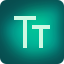
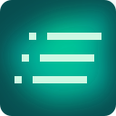
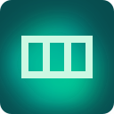
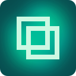
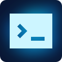

<div align="center">
  

  <p><strong>The open-source Swiss Army knife for Elementor design.</strong></p>
  <!-- Badges -->
  
  
  
  
  
  
  
  
  
</div>

Aurora adds **advanced text animations** (GSAP + Anime.js), **staggered children element animations**, **multi-stop gradients** (including a mouse-following spotlight), **glassmorphism**, and a **custom cursor follow effect** to the **Advanced** tab of every Elementor widget, section, column, and container — no code required, straight from the panel.

---

<h2 style="display: flex; align-items: center;">
  
  Features
</h2>

<h3 style="display: flex; align-items: center;">
  
  Module 1 — Text Animation
</h3>

Available on **any Elementor widget** (Heading, Text Editor, Button, etc.) via **Advanced → ✨ Text Animation (Aurora)**.

Automatically splits text content into **characters**, **words**, or **lines** and applies one of **24 available animations**, triggered on scroll or on page load.

| # | Library | Name | Effect |
|---|---------|------|--------|
| gs-1 | GSAP | Fade Up | Characters rise with fade |
| gs-2 | GSAP | Clip Reveal | Slides up from behind a mask |
| gs-3 | GSAP | Scramble Text | Shuffles characters → reveals final text |
| gs-4 | GSAP | Elastic Bounce | Bounces with elastic easing |
| gs-5 | GSAP | 3D Flip | Y-axis rotation in 3D perspective |
| gs-6 | GSAP | Slide In | Slides in from the left |
| gs-7 | GSAP | Scale Up | Grows from zero |
| gs-8 | GSAP | Wave | Sinusoidal Y offset per index |
| gs-9 | GSAP | Bounce Drop | Drops from above with bounce |
| gs-10 | GSAP | Glitch | Digital shake then stabilizes |
| ml-1 | Anime.js | Float Up | Rises smoothly (easeOutExpo) |
| ml-2 | Anime.js | Scale In | Scale 0.2 → 1 with back ease |
| ml-3 | Anime.js | Drop Down | Falls from above (easeOutExpo) |
| ml-4 | Anime.js | Slide From Right | Slides in from the right |
| ml-5 | Anime.js | Wave | Sinusoidal wave by index |
| ml-6 | Anime.js | Flip X | 3D rotation on the X axis |
| ml-7 | Anime.js | Typewriter | Typewriter effect, one character at a time |
| ml-8 | Anime.js | Blur Reveal | Blurred → sharp |
| ml-9 | Anime.js | Skew In | Skews then snaps into position |
| ml-10 | Anime.js | Explosion | Large scale → normal |
| ml-11 | Anime.js | Native Split (Letters) | Native Anime.js v4 text splitter, per letter |
| ml-12 | Anime.js | Clip Wrap (Words) | Masked reveal per word |
| ml-13 | Anime.js | Echo Clone (Letters) | Cloned trailing echo per letter |
| ml-14 | Anime.js | Native Scramble | Native Anime.js v4 scramble effect |

**Available controls per animation:**
- Library (GSAP / Anime.js)
- Animation type
- Split by (Characters / Words / Lines)
- Duration (ms)
- Initial delay (ms)
- Stagger delay between units (ms)
- Trigger: scroll or page load
- Visibility threshold (%)
- Replay on re-entering viewport

---

<h3 style="display: flex; align-items: center;">
  
  Module 2 — Animate Children Elements
</h3>

Available on **Sections, Columns, Containers, and Widgets** via **Advanced → 🎬 Animate Children Elements (Aurora)**.

Applies an entrance animation in cascade (stagger) to each child element, one after the other, with a configurable delay.

**Available animations:**
| Name | Effect |
|------|--------|
| Fade Up | Rises with fade (default) |
| Fade Down | Drops with fade |
| Fade In | Opacity only |
| Slide Left | Slides in from the left |
| Slide Right | Slides in from the right |
| Zoom In | Grows from 65% → 100% |
| Zoom Out | Shrinks from 135% → 100% |
| Flip Up | 3D rotation on the X axis |
| Rotate In | Z rotation + scale |
| Bounce In | Rises with elastic ease |

**Available controls:**
- Animation type
- CSS selector for children (customizable)
- Duration per child (ms)
- Initial delay (ms)
- Stagger delay between children (ms)
- Trigger: scroll or page load
- Visibility threshold (%)
- Replay on re-entering viewport

---

<h3 style="display: flex; align-items: center;">
  
  Module 3 — Gradient
</h3>

Available on **Sections, Columns, Containers** (as a background) and on **Heading / Text Editor** widgets (as a text-fill) via **Advanced → 🌈 Gradient (Aurora)**.

Multi-stop gradients (3 or more colors, each with its own position) in linear, radial, or conic form, with three optional motion modes:

| Mode | Effect |
|------|--------|
| Static | No motion — a plain multi-stop gradient |
| Mesh (backgrounds) / Pan (text) | Backgrounds get drifting blurred color blobs; text gets a sliding gradient (background-clip:text can't render blurred blob layers) |
| Color Loop | Continuous hue-rotation cycle |
| **Follow Mouse (Spotlight)** | Radial-only: recenters the gradient on the live cursor position as it moves over the element — the same "spotlight" effect used behind a hero or footer background |

**Available controls:**
- Type (Linear / Radial / Conic)
- Angle (linear/conic)
- Gradient colors (repeater, min. 3, each with its own position %)
- Follow Mouse toggle + spotlight radius (px) — radial only
- Animate toggle + Animation Style (Mesh/Pan or Color Loop) + Cycle Duration (s) — hidden while Follow Mouse is active, since the two drive the background in incompatible ways (one from a timer, the other from the cursor)

---

<h3 style="display: flex; align-items: center;">
  
  Module 4 — Glassmorphism
</h3>

Available on the **Image** widget and on **Sections, Columns, Containers** via **Advanced → 🧊 Glassmorphism (Aurora)**.

A translucent, blurred "frosted glass" background — glass color, background opacity, blur intensity, saturation, border opacity, and border radius — resolved entirely in PHP into a single inline `style` attribute, with a CSS fallback for browsers without `backdrop-filter` support. No JavaScript involved.

---

<h3 style="display: flex; align-items: center;">
  Module 5 — Cursor Follow
</h3>

Available on **any Elementor element** (widgets, Sections, Columns, Containers) via **Advanced → 🖱️ Cursor Follow (Aurora)**.

Replaces the native cursor with a two-part custom cursor — an inner dot that tracks the mouse instantly and an outer ring that trails behind it — while the pointer is inside the element it's enabled on ("zone"). Zones can be nested (e.g. a hero section zone with a button zone inside it); the innermost one under the cursor wins. Interactive elements (links, buttons) and images each get their own configurable hover scale and highlight color, matching a common pattern from modern agency/portfolio sites.

**Available controls:**
- Dot color, ring color
- Dot size (px), ring resting size (px)
- Trail delay (ms) — how long the ring takes to catch up with the dot
- Interactive elements selector (default `a, button, .cursor-pointer`) + hover scale
- Image elements selector (default `img, .zoom-target`) + hover scale

---

<h2 style="display: flex; align-items: center;">
  
  Installation
</h2>

### Via ZIP upload

1. Download this repository as a `.zip`
2. In the WordPress dashboard, go to **Plugins → Add New → Upload Plugin**
3. Select the `.zip` file and click **Install Now**
4. Activate the plugin

### Via FTP / CLI

1. Clone this repository inside `wp-content/plugins/`:

```bash
git clone https://github.com/zmdy/aurora \
  wp-content/plugins/aurora-for-elementor
```

2. Activate the plugin from the WordPress dashboard

---

<h2 style="display: flex; align-items: center;">
  
  Project Specs
</h2>

| Requirement | Minimum version |
|-------------|----------------|
| WordPress | 5.9+ |
| PHP | 7.4+ |
| Elementor | 3.0+ |
| Elementor Pro | Not required |

Animation libraries are bundled with the plugin (no CDN dependency):
- **GSAP 3.12.5** — `assets/js/vendor/gsap.min.js`
- **Anime.js 4.4.1** — `assets/js/vendor/anime.min.js`


### Project Structure

```
aurora-for-elementor/
├── aurora-for-elementor.php                    ← Main bootstrap file
├── includes/
│   ├── class-plugin-core.php                   ← Singleton: loads modules & assets
│   ├── class-animation-module.php              ← Shared base class for every module
│   ├── class-module-manager.php                ← Module registry
│   ├── class-asset-manager.php                 ← Frontend/editor asset enqueueing
│   ├── class-text-animation-controls.php       ← Module 1: Text Animation
│   ├── class-children-animation-controls.php   ← Module 2: Animate Children Elements
│   ├── class-gradient-controls.php             ← Module 3: Gradient (incl. Follow Mouse)
│   ├── class-glassmorphism-controls.php        ← Module 4: Glassmorphism
│   └── class-cursor-follow-controls.php        ← Module 5: Cursor Follow
├── assets/
│   ├── js/
│   │   ├── text-animations.js                  ← 24 animations (GSAP + Anime.js)
│   │   ├── children-animations.js              ← Children stagger (GSAP)
│   │   ├── gradient-module.js                  ← Gradient rendering + mouse tracking
│   │   ├── cursor-follow.js                    ← Dot/ring cursor + zone tracking
│   │   └── vendor/                             ← Bundled GSAP & Anime.js
│   └── css/
│       ├── text-animations.css                 ← Base styles & helpers
│       ├── gradient-module.css                 ← Gradient base styles
│       ├── glass-module.css                    ← Glassmorphism fallback
│       └── cursor-follow.css                   ← Cursor Follow base styles
├── languages/
│   ├── aurora-for-elementor.pot                ← Translation template
│   ├── aurora-for-elementor-pt_BR.po           ← Portuguese (Brazil) translation
│   └── aurora-for-elementor-pt_BR.mo           ← Compiled Portuguese (Brazil) translation
├── LICENSE
└── README.md
```

### Translations

English is the plugin's default language. A Portuguese (Brazil) translation is bundled in `languages/`, loaded automatically via the standard WordPress i18n API (`load_plugin_textdomain`) when the site's locale is `pt_BR`. To add another language, copy `languages/aurora-for-elementor.pot` to `languages/aurora-for-elementor-{locale}.po`, translate the strings, and compile it to a `.mo` file (e.g. with `msgfmt` or Poedit).

### How it works

1. **PHP registers controls** in the Elementor Advanced tab via hooks:
   - `elementor/element/common/section_effects/after_section_end`
   - `elementor/element/section/section_effects/after_section_end`
   - `elementor/element/column/section_effects/after_section_end`
   - `elementor/element/container/section_effects/after_section_end`

2. **PHP injects `data-*` attributes** onto the element wrapper via:
   - `elementor/frontend/element/before_render`
   - `elementor/frontend/widget/before_render`

3. **JavaScript** detects elements by their `data-aurora-*-enable="1"` attribute, registers an Elementor Frontend Handler per module for live preview in the editor, and applies effects via GSAP/Anime.js (animations), `IntersectionObserver` (scroll triggers), or a live `mousemove` listener (the Gradient module's Follow Mouse spotlight and the Cursor Follow module's dot/ring tracking).

## 💡 Inspiration

- [Moving Letters — Tobias Ahlin](https://tobiasahlin.com/moving-letters/)
- [GSAP — GreenSock](https://gsap.com/)
- [Anime.js](https://animejs.com/)
- [Animation Addons for Elementor](https://animation-addons.com/)


---

<h2 style="display: flex; align-items: center;">
  
  Contributing
</h2>

This project is distributed under the [GPL License](./LICENSE).

Pull requests are welcome! For major changes, please open an Issue first to discuss what you'd like to change.

1. Fork the project
2. Create your branch (`git checkout -b feature/new-animation`)
3. Commit your changes (`git commit -m 'feat: add new animation'`)
4. Push to the branch (`git push origin feature/new-animation`)
5. Open a Pull Request

[](https://feitonobrasil.dev.br)
