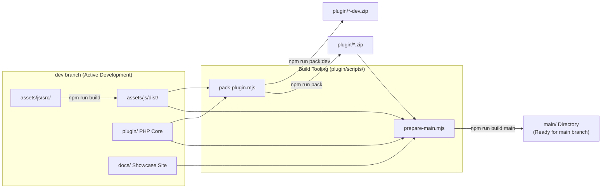

<div align="center">
  

  <p><strong>The open-source Swiss Army knife for Elementor design — Development Repository.</strong></p>
  <!-- Badges -->
  
  
  
  
  
  
  
  
</div>

> [!NOTE]
> **This is the `dev` branch** containing full developer tooling, source code (`assets/js/src/`), packaging scripts (`plugin/scripts/`), and the documentation/showcase site under `docs/`. Production release builds and published site layouts are assembled for `main` via `npm run build:main`.

---

## 🛠️ Developer Quick Reference

```bash
npm install          # Install dev dependencies (Vite & esbuild for text effects)
npm run build        # Compile assets/js/src/ -> assets/js/dist/ (all 88 text effects + bundles)
npm run pack:dev     # Build development ZIPs (stamped with -dev suffix and (Dev) title)
npm run pack         # Build release FINAL ZIPs (enforces changelog & version checks)
npm run build:main   # Assemble complete main-branch release layout into main/
```

---

## 📦 Project Architecture & Branches

The project maintains a clean separation between **active development** (`dev`) and **production release distribution** (`main`):



### Directory Structure (`dev` branch)

```
aurora/
├── assets/                                     ← Core assets shared by plugin and showcase site
│   ├── js/
│   │   ├── src/                                ← SOURCE for Text Animations (ES Modules)
│   │   │   ├── core/                           ←   Runtime engine, DOM splitter, Elementor handler
│   │   │   ├── effects/gsap/                   ←   One file per GSAP effect (gs-1 … gs-35)
│   │   │   ├── effects/anime/                  ←   One file per Anime.js effect (ml-1 … ml-53)
│   │   │   └── entries/                        ←   frontend-core.js and editor.js entry points
│   │   ├── dist/                               ← BUILD OUTPUT (committed to repo)
│   │   │   ├── aurora-text-core.js             ←   Complete frontend bundle (all 88 effects bundled)
│   │   │   ├── aurora-text-editor.js           ←   Editor bundle with preview handlers
│   │   │   └── effects/{id}.js                 ←   Standalone effect chunks
│   │   ├── children-animations.js              ← Module 2: Children cascade/stagger + blur set
│   │   ├── gradient-module.js                  ← Module 3: Multi-stop gradient & spotlight
│   │   ├── cursor-follow.js                    ← Module 4: Custom cursor tracker
│   │   └── vendor/                             ← Bundled vendor libs (gsap.min.js, anime.min.js)
│   └── css/
│       ├── text-animations.css                 ← Text animations reset & base styles
│       ├── children-animations.css             ← Children blur animation keyframes
│       ├── gradient-module.css                 ← Gradient base styles
│       └── cursor-follow.css                   ← Cursor follow base styles
├── docs/                                       ← Showcase and documentation site
│   ├── index.html                              ←   Showcase landing page
│   └── text-effects/                           ←   Interactive text effects catalog
├── plugin/                                     ← WordPress Plugin root
│   ├── aurora-for-elementor.php                ←   Main plugin bootstrap file
│   ├── includes/                               ←   PHP classes & Elementor control modules
│   │   ├── class-plugin-core.php               ←     Singleton bootstrap & loader
│   │   ├── class-animation-module.php          ←     Base class for Elementor modules
│   │   ├── class-asset-manager.php             ←     Asset enqueuing & deduplication
│   │   ├── class-text-animation-controls.php   ←     Module 1: Text Animation
│   │   ├── class-children-animation-controls.php ←   Module 2: Children Animation
│   │   ├── class-gradient-controls.php         ←     Module 3: Gradient
│   │   └── class-cursor-follow-controls.php    ←     Module 4: Cursor Follow
│   ├── languages/                              ←   i18n POT/PO/MO files
│   ├── scripts/                                ←   Node.js packaging & build automation
│   │   ├── build-text-effects.mjs              ←     Compiles assets/js/src/ → assets/js/dist/
│   │   ├── pack-plugin.mjs                     ←     Cross-platform ZIP packaging script
│   │   └── prepare-main.mjs                    ←     Main branch layout assembler
│   ├── readme.txt                              ←   WordPress.org readme (Full version)
│   └── readme-light.txt                        ←   WordPress.org readme (Light version)
├── package.json
└── README.md
```

---

## ⚡ Build System & Commands

### 1. Compiling Text Effects (`npm run build`)

The Text Animation module's source is modularized in `assets/js/src/`. To compile it into production bundles:

```bash
npm run build
```

This runs `plugin/scripts/build-text-effects.mjs` using Vite's programmatic API to generate:
- **`aurora-text-core.js`**: Frontend runtime bundle containing all 88 GSAP & Anime.js effects registered synchronously on load (~73 KB total, ~15 KB gzipped).
- **`aurora-text-editor.js`**: Editor-specific bundle loaded inside the Elementor editor with live controls preview.
- **`effects/{id}.js`**: Individual standalone chunk files for compatibility.

> [!TIP]
> Always run `npm run build` after modifying any file in `assets/js/src/` before creating a package or testing changes.

---

### 2. Packaging Plugin ZIPs (`npm run pack` / `npm run pack:dev`)

Aurora ships in two distinct package editions:
1. **Full Edition (`aurora-for-elementor-full*.zip`)**: Includes GSAP, Anime.js, and all 88 text effect animations.
2. **Light Edition (`aurora-for-elementor-light*.zip`)**: Excludes the proprietary GSAP vendor files and GSAP effects, automatically falling back to Anime.js (100% MIT/GPL compatible, ready for WordPress.org).

The packager supports **two build modes**:

#### A. Development Build Mode (`npm run pack:dev` or `npm run pack dev`)

```bash
npm run pack:dev
```

- **Purpose**: Creates ZIP packages for testing on local or staging WordPress sites.
- **Dev Stamping**: Automatically stamps the staged plugin with development markers:
  - Appends `-dev` to the version in `aurora-for-elementor.php` (e.g. `0.7.1-dev`), which also updates `AURORA_VERSION` for browser cache-busting.
  - Adds `(Dev)` to the Plugin Name in the header (`Aurora for Elementor (Dev)`).
  - Updates `Stable tag:` to `<version>-dev` in `readme.txt`.
  - Outputs files as **`aurora-for-elementor-full-dev.zip`** and **`aurora-for-elementor-light-dev.zip`** in `plugin/`.
- **Zero Repo Dirt**: Dev metadata is applied **only** to the temporary staging directory (`_dist_temp`) during packaging — committed source files remain 100% clean.

#### B. Final Release Build Mode (`npm run pack`)

```bash
npm run pack
```

- **Purpose**: Compiles clean, production-ready release ZIPs: **`aurora-for-elementor-full.zip`** and **`aurora-for-elementor-light.zip`** in `plugin/`.
- **Enforced Release Guards**:
  - **Version Sync**: Reads the canonical version from `aurora-for-elementor.php` and synchronizes `Stable tag:` in `readme.txt` and `readme-light.txt`.
  - **Changelog Validation**: Verifies that the newest heading in `== Changelog ==` of both readmes matches the version being packaged. If missing, the build fails with an explicit error to prevent shipping unversioned changelogs.
  - **WordPress Version Check**: Queries `api.wordpress.org` to check the current stable WordPress release and syncs `Tested up to:` (gracefully skips if offline).
  - **License Bundling**: Ensures the full GPLv3 `LICENSE.txt` is bundled in the root of both packages.

---

### 3. Main Branch Assembler (`npm run build:main`)

The `dev` branch contains development tooling and docs, while the `main` branch contains the clean distribution layout and site root. The assembler bridges this workflow:

```bash
npm run build:main
```

This runs `plugin/scripts/prepare-main.mjs`, which compiles and stages the entire `main` branch into a top-level `main/` directory:

```
main/
├── index.html                           ← Site home (moved from docs/ with rewritten asset paths)
├── assets/                              ← Shared production assets (js/src excluded)
├── docs/
│   └── text-effects/index.html          ← Interactive showcase pages (paths updated)
└── build/                               ← Production ZIPs (FINAL build mode)
    ├── aurora-for-elementor-full.zip
    └── aurora-for-elementor-light.zip
```

#### Path Transformations Handled Automatically:
- **`main/index.html`**: Re-points `../assets/` to `./assets/` and links to `text-effects/` to `./docs/text-effects/`.
- **`main/docs/*`**: Re-points home navigation links to `../../` while preserving relative asset paths.
- **Distribution Packages**: Automatically invokes `pack-plugin.mjs` in FINAL mode and places both ZIP archives in `main/build/`.

---

## 🔄 Release & Deployment Workflow

To release a new version from `dev` to `main`:

1. **Bump Version & Update Changelog**:
   - Update `Version: x.y.z` in `plugin/aurora-for-elementor.php`.
   - Add a `= x.y.z =` entry under `== Changelog ==` in `plugin/readme.txt` and `plugin/readme-light.txt`.
2. **Compile JS Bundles**:
   ```bash
   npm run build
   ```
3. **Assemble Main Branch Directory**:
   ```bash
   npm run build:main
   ```
4. **Deploy to `main`**:
   - Verify contents in `main/`.
   - Commit changes on `dev` and push:
     ```bash
     git add .
     git commit -m "chore: prepare release x.y.z"
     git push origin dev
     ```
   - Synchronize/push the assembled `main/` output to the `main` branch.

---

## 🧩 Core Animation Modules

### Module 1 — Text Animation
- **Hook**: `Advanced → ✨ Text Animation (Aurora)` on headings, text editors, buttons.
- **Features**: Splits text by **Chars**, **Words**, or **Lines**.
- **Libraries**: 35 GSAP effects + 53 Anime.js effects (88 total).
- **Triggers**: Scroll (with configurable threshold and replay) or Page Load.
- **Extras**: Hover Scatter interaction with intensity and duration controls.

### Module 2 — Animate Children Elements
- **Hook**: `Advanced → 🎬 Animate Children Elements (Aurora)` on Containers, Sections, Columns, and Widgets.
- **Features**: Cascading stagger animations on direct children.
- **Effects**: Fade (Up/Down/In), Slide (Left/Right), Zoom (In/Out), Flip Up, Rotate In, Bounce In, and Blur entrance set.

### Module 3 — Gradient
- **Hook**: `Advanced → 🌈 Gradient (Aurora)` on Containers (background) and Headings/Text (text-fill).
- **Features**: Multi-stop Linear, Radial, and Conic gradients with color stops repeater.
- **Motion Styles**: Static, Pan / Mesh, Color Loop (hue rotation), and **Follow Mouse (Spotlight)** tracking.

### Module 4 — Cursor Follow
- **Hook**: `Advanced → 🖱️ Cursor Follow (Aurora)` on any element.
- **Features**: Two-part interactive custom cursor (inner dot + trailing outer ring) with interactive element scaling (links, buttons, images).

---

## 🌐 Translations & Internationalization

Default language: **English (`en_US`)**.  
Bundled translations: **Portuguese - Brazil (`pt_BR`)**.

Translation files live in `plugin/languages/`:
- `aurora-for-elementor.pot` — Translation template.
- `aurora-for-elementor-pt_BR.po` / `.mo` — Brazilian Portuguese translation.

To regenerate or compile translations:
```bash
# Compile PO to MO (using gettext msgfmt)
msgfmt plugin/languages/aurora-for-elementor-pt_BR.po -o plugin/languages/aurora-for-elementor-pt_BR.mo
```

---

## 📜 License

Aurora for Elementor is open-source software licensed under the [GNU General Public License v3.0 (GPLv3)](./LICENSE).

[](https://feitonobrasil.dev.br)
